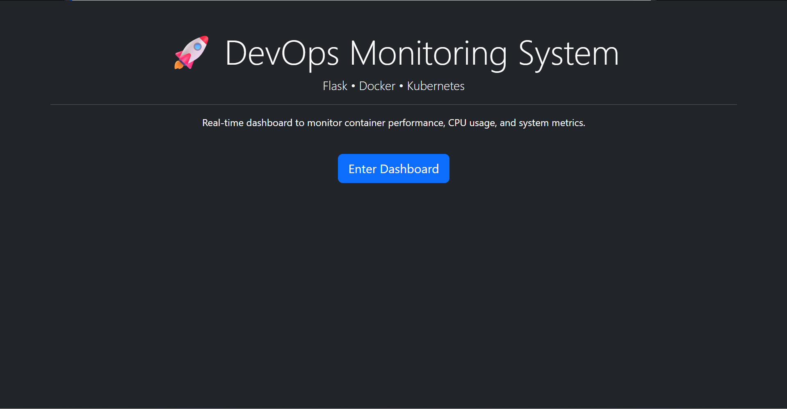
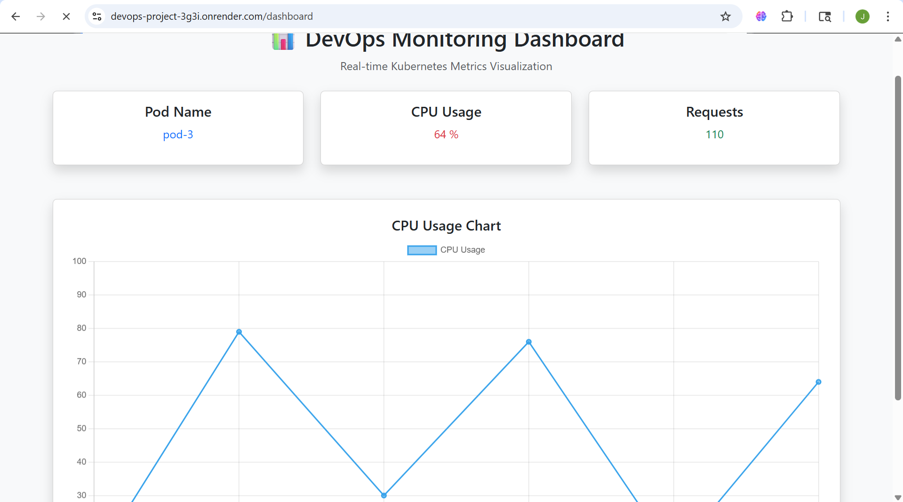

# 🚀 DevOps Monitoring System (Flask + Docker + Kubernetes + Cloud)

## 📌 Project Overview
This project is a DevOps-based web application that demonstrates end-to-end deployment of a Flask app using Docker and Kubernetes, along with a real-time monitoring dashboard.

---

## 🌐 Live Demo
🔗 https://your-render-link.onrender.com  

---

## 🧠 Features
- 🎨 Modern UI with Bootstrap
- 📊 Real-time Dashboard
- 🔄 Auto-refresh every 3 seconds
- 📈 CPU Usage Chart
- ⚙️ Simulated Kubernetes Load Balancing
- 🐳 Docker Containerization
- ☸️ Kubernetes Deployment
- ☁️ Cloud Deployment

---

## 🏗️ Architecture
User → Web UI → Flask App → Docker → Kubernetes → Dashboard

---

## ⚙️ Tech Stack
- Frontend: HTML, CSS, Bootstrap
- Backend: Flask (Python)
- Charts: Chart.js
- Containerization: Docker
- Orchestration: Kubernetes
- Deployment: Render

---

## 🚀 How to Run

### Run Locally
python app.py

Open: https://devops-project-3g3i.onrender.com/

---

## 👩‍💻 Author
Vennacheti Jayanthi

---

## ⭐ Conclusion
This project demonstrates a complete DevOps workflow with a real-time dashboard.

